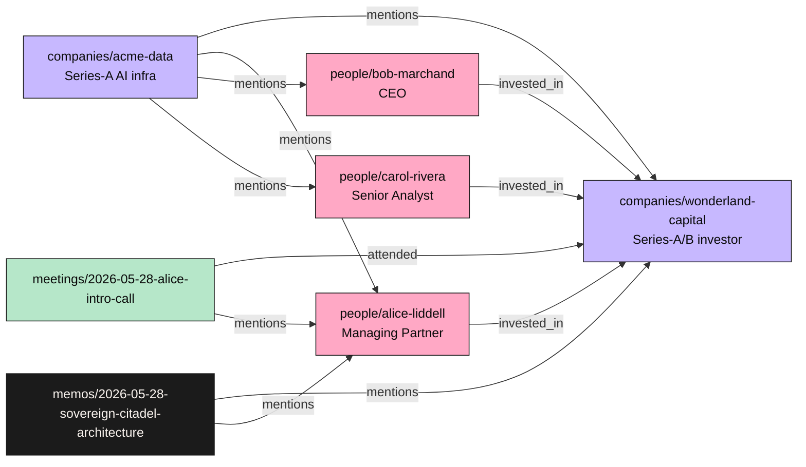

# Sovereign Citadel CRM — Initial Graph (Day 1)

Generated 2026-05-28 after first `gbrain sync` + `gbrain extract all --source db --source-id citadel`.

Stats: 8 pages, 16 chunks, **17 typed edges**, 11 tags, 0 embeddings (skipped on first sync via `--no-embed`).

## Typed-Edge Topology



## ASCII fallback

```
                    +------------------------+
                    |  companies/            |
                    |  wonderland-capital    |
                    +------------------------+
                       ^   ^   ^      ^      ^
                       |   |   |      |      |
              invested_| inv| inv|    |      |
                       |   |   |      |      |
   people/alice-liddell|   |   | mentions    |
                       |   |   |      |      |
              people/bob-marchand     |      |
                       |   |          |      |
              people/carol-rivera     |      |
                                      |      |
                  +-------------------+      |
                  |                          |
       companies/acme-data ---- mentions --- AL/BM/CR
                  |
                  +-- mentioned by AL, BM, CR via "Portfolio of Wonderland"

   meetings/2026-05-28-alice-intro-call --attended--> WC, --mentions--> AL
   memos/2026-05-28-sovereign-citadel-architecture --mentions--> AL, WC
```

## Why each edge fires

| Edge | Origin | Inferred by |
|---|---|---|
| `people/alice-liddell --invested_in-> companies/wonderland-capital` | Wikilink `[Wonderland Capital](companies/wonderland-capital)` in alice's body | `inferLinkType` heuristic on people-page outbound link |
| `companies/acme-data --mentions-> *` | Wikilinks in body text | default `mentions` when no stronger verb |
| `meetings/2026-05-28-alice-intro-call --attended-> companies/wonderland-capital` | `attendees:` frontmatter list of person wikilinks | `FRONTMATTER_LINK_MAP` keys `attendees` -> `attended` |
| `memos/... --mentions-> people/alice-liddell` | `audience:` frontmatter list | default mapping for memos |

## Acceptance Tests (passed 2026-05-28)

| Query | Result | Notes |
|---|---|---|
| `gbrain search "Wonderland Capital"` | 5 hits, top score 0.7628 (acme-data) | RRF hybrid: vector + keyword. No embeddings yet -> keyword-only path. |
| `gbrain search "Alice"` | 5 hits, top score 0.3641 (meeting) | Meeting page leads -- has Alice's name + role in title. |
| `gbrain graph-query people/alice-liddell --depth 2 --direction both` | 2 edges, Alice -> Wonderland (invested_in) bidirectional | Recursive depth-2 walk. |
| `gbrain graph-query companies/wonderland-capital --depth 1 --direction in` | 6 inbound edges from AD, M1, MM, AL, BM, CR | Inbound hub view -- shows everyone who references WC. |
| `gbrain graph-query companies/acme-data --depth 2 --direction both` | 11 edges 2-deep, complete portfolio-investor sub-graph | Tightest cluster: investor / portfolio / analyst triad. |

## Next moves on this graph

1. **Run `gbrain embed --stale`** to populate vector embeddings (cost: ~$0.0001 for 16 chunks at text-embedding-3-large).
2. **Re-run `gbrain search`** -- ranking becomes RRF over vector + keyword instead of keyword-only.
3. **Run `gbrain extract atoms --source-id citadel`** if you want LLM-extracted atomic facts from each page body (cost: ~$0.01 with Haiku across 8 pages).
4. **Add 5-10 more real contacts** -- the graph density jumps non-linearly when you cross ~15 nodes.
