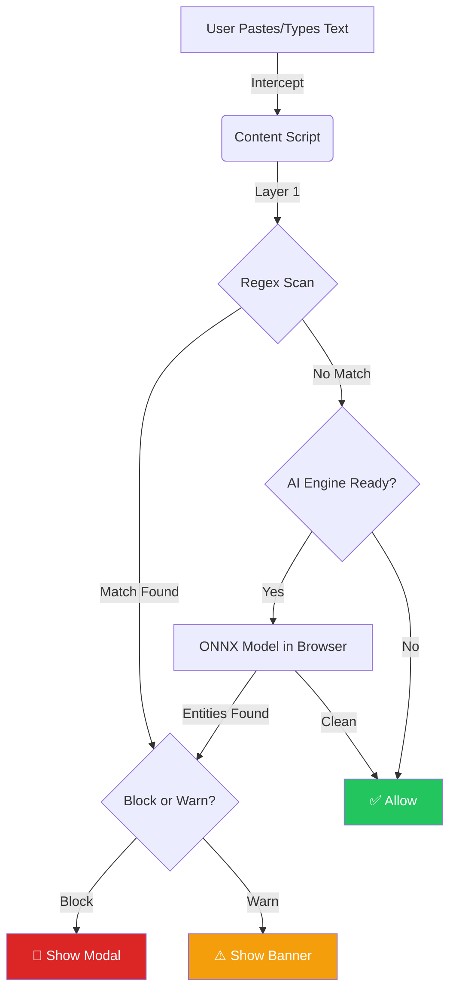

# privacyshield-ai/privacy-firewall

Audit generated: 2026-05-27T23:58:07.261844+00:00
Local clone: `repos-audit\privacyshield-ai__privacy-firewall`

## GitHub Metrics (Scrapling probe)

- **stars_abbrev:** 237
- **stars_exact:** 237
- **forks:** 25
- **open_issues:** 2
- **open_prs:** 0
- **last_commit_utc:** 2026-01-16T06:48:03Z
- **description:** A local AI-powered DLP solution . Contribute to privacyshield-ai/privacy-firewall development by creating an account on GitHub.

## Git Snapshot

- branch: `main`
- head:   `c91bb1b7304eceb234e09234f85a50bdcdf69712`
- last commit: 2026-01-15 23:54:22 -0700 c91bb1b arnab.karsarkar
- contributors in shallow clone: 1
- top contributors (shallow):
    1	arnab.karsarkar <sarkar.arnab2007@gmail.com>

## License

MIT License | Copyright (c) 2025 [Your Name]

## Languages (by total bytes — top 10)

- `.gif`: 15,752,262 bytes
- `.png`: 653,572 bytes
- `.js`: 133,815 bytes
- `.json`: 56,312 bytes
- `.md`: 13,980 bytes
- `.css`: 8,173 bytes
- `.html`: 6,183 bytes
- `(noext)`: 1,261 bytes
- `.example`: 372 bytes

## Dependencies

_(no dependency manifest detected)_
## README — first 80 lines

```
<p align="center">
  
</p>

<h1 align="center">PrivacyFirewall</h1>

👋 **If you're trying PrivacyFirewall, please star the repo!** 
> It helps others discover the project and motivates development.
> Takes 2 seconds → ⭐ (top right)

<p align="center">
  <strong>Stop AI Data Leaks Before They Happen</strong><br>
  100% Local • Zero Server • Full Control
</p>

<p align="center">
  
  
  
  
</p>

<p align="center">
  
</p>

---

## The Problem

Every day, sensitive data gets leaked to AI chatbots:

- 📧 **Customer emails** pasted into ChatGPT for summarization
- 🔑 **API keys** accidentally included in code snippets
- 👤 **Employee names** shared in meeting notes
- 💳 **Credit card numbers** copied from support tickets
- 🏠 **Home addresses** in shipping data analysis

**Traditional DLP tools don't protect AI chat interfaces.** PrivacyFirewall does.

---

## The Solution

**PrivacyFirewall** intercepts sensitive data *before* it reaches AI tools — running **entirely in your browser** with no external servers.

### Key Features

| Feature | Description |
|---------|-------------|
| 🛡️ **Paste Protection** | Blocks sensitive pastes with a confirmation modal |
| ⌨️ **Real-time Typing Detection** | Warns as you type sensitive data |
| 🧠 **Local AI Detection** | BERT NER model runs in-browser via ONNX/WASM |
| ⚙️ **Configurable Rules** | Enable/disable specific PII types, set block vs warn |
| 🌐 **Site Management** | Protect ChatGPT, Claude, Gemini, Copilot, and more |
| 🔒 **Zero Data Transmission** | Nothing ever leaves your machine |

---

## How It Works



### Two-Layer Protection
```
